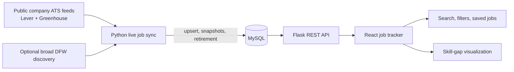

# NovaTeck Cap I Architecture



## Live-data maintenance

- `backend/job_sync.py` reads the public company sources in
  `backend/crawler/company_sources.json` and can be safely rerun.
- A stable job URL is the deduplication key. Changed jobs receive a
  `Job_Snapshots` record and refreshed NLP skill tags.
- Only a complete successful run of an authoritative company board can retire
  that board's missing jobs. The five-minute MySQL-clock guard prevents a
  fresh job from being retired because of host clock differences.
- Codex schedules a local sync at 6 AM and 6 PM. Its outcome is saved in
  `Job_Sync_Runs` and is available at `GET /api/jobs/sync-status`.
- Add companies by adding a public Lever or Greenhouse board configuration;
  each request is rate-limited per host. Do not add private, paid, or
  login-protected sources.

## Local verification

```bash
cd backend
../.venv/bin/python migrate.py
../.venv/bin/python job_sync.py --dry-run
../.venv/bin/python job_sync.py
../.venv/bin/python -m unittest discover -s tests -v
```
